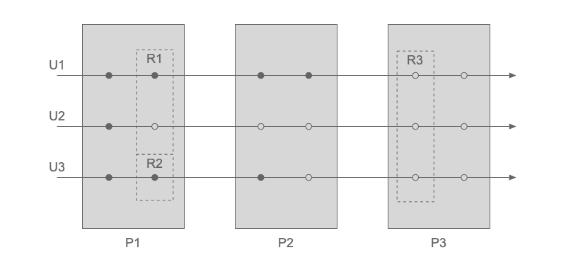

# Chronon

A discrete event framework based on [SimPy](https://simpy.readthedocs.io).

## Installing

```sh
pip install chronon
```

## Getting Started

In Chronon, `Users` follow steps within `Processes`, which can depend on `Resources`.
When a step is executed, an `Event` happens. Such logic is illustrated below:



In the figure, three `Users` (U1, U2 and U3) go through three `Processes` (P1, P2 and P3).
Each `Process` is constituted by two steps, denoted by the circles. When a step is triggered it defines an `Event`.
Some steps are dependent on `Resources` (R1, R2 and R3), which can be shared between users or not.

### Instantiating a Process Manager

When expressing discrete event problems in Chronon, the first task is to instantiate a ``ProcessManager``:

```python
from chronon import ProcessManager
pm = ProcessManager()
```

### Creating Resources

`Resources` can then be created by calling ``create_resource`` with a name or a list of names.
Keyword arguments, such as ``capacity``, follow [SimPy](https://simpy.readthedocs.io) definitions:

```python
pm.create_resource(['ResourceOne', 'ResourceTwo', 'ResourceThree'])
pm.create_resource('ResourceFour', capacity=3)
```

### Defining Processes

Each `Process` is specified by overwriting the ``definition`` method of the base ``Process`` class:

```python
from chronon import Process
class MyProcess(Process):
  def definition(self, user):
      yield user.waits(user.some_resource_needed)
      yield user.waits(5)
      user.releases(user.some_resource_needed)

      yield user.waits(['R1', 'R2'])
      yield user.waits(0.3)
      user.releases(['R1', 'R2'])
```

A ``definition`` method must expect a ``user``,
from which attributes can be extracted in order to customise the process execution for each user.
Each step is expressed in a ``yield`` statement in which an ``user`` waits for some period time or for the availability of one or multiple resources.
Once the user finishes the use of a resource, it is released by calling the ``user.releases`` method.
The ``user.waits`` method understands integers (``5``), floats (``2.5``), strings (``'R1'``) and lists of strings (``['R1', 'R2']``).

It is possible to define a tolerance for the user waiting time for a resource by setting a ``patience``.
If the ``patience`` time has passed and the resources are still not available, the request is cancelled and subsequent logic of the ``Process`` is executed:

```python
yield user.waits(user.required_resources, patience=15)
```

Once a process is defined, it is attached to a ``ProcessManager`` by calling:

```python
pm.attach_process(MyProcess)
```

### Defining the Flow

If your simulation consists of a single process, you can proceed with the instantiation of an Event Manager. Otherwise, in more complex simulations constituted by multiple processes, the sequence logic is defined through the ``set_flow`` method.
It can be called multiple times, defining the link between each process of the simulation:

```python
pm.set_flow(initial_process='MyProcess')
pm.set_flow(from_process='MyProcess', to_process='AnotherProcess')
pm.set_flow(from_process='AnotherProcess', to_process='LastProcess')
pm.set_flow(final_process='LastProcess')
```

The flow above can also be expressed in a single call as:

```python
pm.set_flow(sequence=['MyProcess', 'AnotherProcess', 'LastProcess'])
```

An initial master flow defined via ``sequence`` can also have more links added to it via ``from_process``-``to_process`` syntax:

```python
pm.set_flow(sequence=['MyProcess', 'AnotherProcess', 'LastProcess'])
pm.set_flow(from_process='AnotherBranch', to_process='LastProcess')
```

| :warning: IMPORTANT        |
|:---------------------------|
| When ``set_flow`` is called using the ``sequence`` argument, the flow is reset, ignoring any specific links previously defined.      |

Note that it is possible to define several parallel flows that will never intersect within the same process manager. In this scenario, it's mandatory to declare the initial process for each user explicitly.

### Instantiating an Event Manager

Once all the processes are defined, an `EventManager` must be created for managing the simulation execution:

```python
from chronon import EventManager
em = EventManager(pm)
```

### Creating Users

The `users` are then created by calling:

```python
em.create_user('UserOne', some_resource_needed='ResourceOne', some_attribute='green')
em.create_user('UserTwo', instant=3, some_resource_needed='ResourceOne', some_attribute='red')
em.create_user('UserThree', instant=5, some_resource_needed='ResourceTwo', some_attribute='blue')
em.create_user('UserFour', instant=8, initial_process='AnotherBranch', some_resource_needed='ResourceTwo', some_attribute='blue')
```

where the first argument is the user's name and the following are parameters used in the logic of the processes.
The optional ``instant`` argument defines the moment when the user enters the simulation (zero by default).
The optional ``initial_process`` argument defines the initial process for that particular user, if different from the global one.

If necessary, users attributes can be updated after creation by calling:

```python
em.set_user('UserOne', some_attribute='purple')
```

### Running the Simulation

Finally, the simulation is run by calling:

```python
em.run()
```

## Reporting

The usage of resources is easily accessible in ``resource.usage``.
This data frame tracks the key instants of the relation between users and resources:

- ``Requested``: moment when a user requests the resource
- ``Using``: moment when a user starts to use a resource
- ``Released``: moment when a user releases a resource

```sh
>>> print(pm.get_resource('R1').usage)
      instant        user     status
0    0.169643  customer_3  Requested
1    0.169643  customer_3      Using
2    0.473589  customer_3   Released
3    0.483617  customer_4  Requested
4    0.483617  customer_4      Using
5    1.867672  customer_0  Requested
6    3.514652  customer_4   Released
7    3.514652  customer_0      Using
8    6.186171  customer_2  Requested
9   14.947449  customer_1  Requested
10  17.064728  customer_0   Released
11  17.064728  customer_1      Using
12  22.871759  customer_1   Released
```

In addition to the resources reporting, custom key time instants can be registered as
checkpoints along the simulation by calling the ``user.set_checkpoint`` method:

```python
user.set_checkpoint('Requested resource')
user.waits(user.some_resource)
user.set_checkpoint('Using resource')
```

The checkpoints for a specific user will then be available in ``user.checkpoints``:

```sh
>>> print(user.checkpoints)
   instant   info
0       15   Requested resource
1       18   Using resource
```

The logs of all users' checkpoints in the simulation are available in the Event Manager:

```sh
>>> print(em.checkpoints)
   instant   user      info
0        4   UserOne   Requested resource
1        4   UserOne   Using resource
2       15   UserTwo   Requested resource
3       18   UserOne   Released resource
4       18   UserTwo   Using resource
```

## Development

Dependencies and packaging are managed using [Poetry](https://github.com/python-poetry/poetry).

Install poetry and clone the repository

To create a virtual environment and install dependencies

```sh
poetry install
```

To run tests

```sh
poetry run pytest
```

To run linting

```sh
poetry run flake8 chronon --statistics
```
To fix linting issue automatically, when possible: `poetry run autopep8 --in-place -r chronon`

To generate the docs

```sh
poetry run sphinx-build -v -v -b html ./docs/source/ ./docs/html
```

## License

This project is licensed under the MIT License - see the [LICENSE.md](LICENSE.md) file for details
