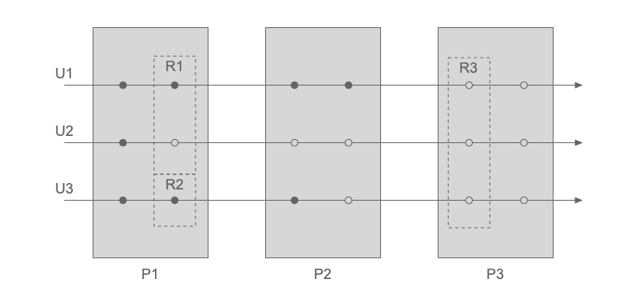

========
Chronon
========
Chronon is a Discrete Event Simulator built on top of `SimPy <https://simpy.readthedocs.io>`_.

In Chronon, `Users` follow steps in `Processes`, which can depend on `Resources`.
When a step is executed, an `Event` happens. Such logic is illustrated below:

In the figure, three `Users` (U1, U2 and U3) go through three `Processes` (P1, P2 and P3).
Each `Process` is constituted by two steps, denoted by the circles. When a step is triggered it defines an `Event`.
Some steps are dependent on `Resources` (R1, R2 and R3), which can be shared between users or not.

Instantiating a Process Manager
-------------------------------
When expressing discrete event problems in Chronon, the first task is to instantiate a ``ProcessManager``::

  from chronon import ProcessManager
  pm = ProcessManager()

Creating Resources
------------------
`Resources` can then be created by calling ``create_resource`` with a name or a list of names.
Keyword arguments, such as ``capacity``, follow `SimPy` definitions::

  pm.create_resource(['ResourceOne', 'ResourceTwo', 'ResourceThree'])
  pm.create_resource('ResourceFour', capacity=3)

Defining Processes
------------------
Each `Process` is specified by overwriting the ``definition`` method of the base ``Process`` class::

  from chronon import Process
  class MyProcess(Process):
    def definition(self, user):
        yield user.waits(user.required_resources)
        yield user.waits(5)
        user.releases(user.required_resources)

        yield user.waits(['R1', 'R2'])
        yield user.waits(0.3)
        user.releases(['R1', 'R2'])

A ``definition`` method must expect a ``user``,
from which attributes can be extracted in order to customise the process execution for each user.
Each step is expressed in a ``yield`` statement in which an ``user`` waits for some period time or for the availability of one or multiple resources.
Once the user finishes the use of a resource, it is released by calling the ``user.releases`` method.
The ``user.waits`` method understands integers (``5``), floats (``2.5``), strings (``'R1'``) and lists of strings (``['R1', 'R2']``).

It is possible to define a tolerance for the user waiting time for a resource by setting a ``patience``.
If the ``patience`` time has passed and the resources are still not available, the request is cancelled and subsequent logic of the ``Process`` is executed::

  yield user.waits(user.required_resources, patience=15)

Once a process is defined, it is attached to a ``ProcessManager`` by calling::

  pm.attach_process(MyProcess)

Defining the Flow
-----------------
In the case of simulations constituted by multiple processes, the flow is defined through the ``set_flow`` method.
It can be called multiple times in order to define different each link of the whole simulation::

  pm.set_flow(initial_process='MyProcess')
  pm.set_flow(from_process='MyProcess', to_process='AnotherProcess')
  pm.set_flow(from_process='AnotherProcess', to_process='LastProcess')
  pm.set_flow(final_process='LastProcess')

The flow above can also be expressed in a single call as::

  pm.set_flow(sequence=['MyProcess', 'AnotherProcess', 'LastProcess'])

An initial master flow defined via ``sequence`` can also have more links added to it via ``from_process``-``to_process`` syntax::

  pm.set_flow(sequence=['MyProcess', 'AnotherProcess', 'LastProcess'])
  pm.set_flow(from_process='AnotherBranch', to_process='LastProcess')

Note that when ``set_flow`` is called using the ``sequence`` argument, the flow is reset, ignoring any specific links previously defined.

Instantiating an Event Manager
------------------------------
Once all the processes are defined, an `EventManager` must be created for managing the simulation execution::

  from chronon import EventManager
  em = EventManager(pm)

Creating Users
--------------
The `users` are then created by calling::

  em.create_user('UserOne', some_resource_needed='R1', some_attribute='green')
  em.create_user('UserTwo', instant=3, some_resource_needed='R1', some_attribute='red')
  em.create_user('UserThree', instant=5, some_resource_needed='R2', some_attribute='blue')
  em.create_user('UserFour', instant=8, initial_process='AnotherBranch', some_resource_needed='R2', some_attribute='blue')

where the first argument is the user's name and the following are arbitrary parameters used in the logic of the processes.
The optional ``instant`` argument defines the moment when the user enters the simulation (zero by default).
The optional ``initial_process`` argument defines the initial process for that particular user, if different from the global one.

If necessary, users attributes can be updated after creation by calling::

  em.set_user('UserOne', some_attribute='purple')

Running the Simulation
----------------------
Finally, the simulation is run by calling::

  em.run()

Reporting
---------

The usage of resources is easily accessible in ``resource.usage``.
This data frame tracks the key instants of the relation between users and resources:
  - ``Requested``: when a user requested the resource
  - ``Using``: when a user started using a resource
  - ``Released``: when a user released a resource

  >>> print(pm.get_resource('R1').usage)
        instant        user     status
  0    0.169643  customer_3  Requested
  1    0.169643  customer_3      Using
  2    0.473589  customer_3   Released
  3    0.483617  customer_4  Requested
  4    0.483617  customer_4      Using
  5    1.867672  customer_0  Requested
  6    3.514652  customer_4   Released
  7    3.514652  customer_0      Using
  8    6.186171  customer_2  Requested
  9   14.947449  customer_1  Requested
  10  17.064728  customer_0   Released
  11  17.064728  customer_1      Using
  12  22.871759  customer_1   Released

In addition to the resources reporting, custom key time instants can be registered as 
checkpoints along the simulation by calling the ``user.set_checkpoint`` method::

  user.set_checkpoint('Requested resource')
  user.waits(user.some_resource)
  user.set_checkpoint('Using resource')

Users' checkpoints are available in ``user.checkpoints``::

  >>> print(user.checkpoints)
     instant   info
  0       15   Requested resource
  1       18   Using resource

The logs of all checkpoints in the simulation are available in the Event Manager::

  >>> print(em.checkpoints)
     instant   user      info
  0        4   UserOne   Requested resource
  1        4   UserOne   Using resource
  2       15   UserTwo   Requested resource
  3       18   UserOne   Released resource
  4       18   UserTwo   Using resource

Contents
--------

.. toctree::
   :maxdepth: 2

   installation
   examples
   modules
   contributing
   authors

Indices and tables
------------------

* :ref:`genindex`
* :ref:`modindex`
* :ref:`search`
